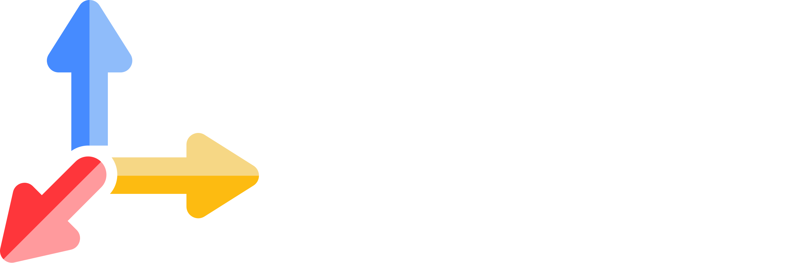

<!-- Hero Section -->
<h1 align="center">Tavily — Making the web instantly accessible for AI :rocket:</h1>
<p align="center">
  
</p>
<p align="center"><em>Search • Extract • Map • Crawl</em></p>
<div align="center">
<p>
<a href="https://www.tavily.com/">
  
</a>
<a href="https://www.npmjs.com/package/@tavily/core">
  
</a>
<a href="https://pepy.tech/project/tavily-python">
  
</a>
</p>
<p>
<a href="https://status.tavily.com/">
  
</a>
<a href="https://www.linkedin.com/company/tavily">
  
</a>
<a href="https://x.com/tavilyai">
  
</a>
</p>
</div>
<p align="center">
  
</p>
---
<div align="center">
[](https://github.com/tavily-ai/tavily-python)
[](https://github.com/tavily-ai/tavily-js)
[](https://github.com/tavily-ai/meeting-prep-agent)
[](https://github.com/tavily-ai/use-cases)
[](https://github.com/tavily-ai/tavily-mcp)
</div>
---
## :star: Getting Started:
<div align="center">
<a href="https://app.tavily.com/home">
  
</a>
<a href="https://app.tavily.com/playground">
  
</a>
<a href="https://docs.tavily.com/welcome">
  
</a>
</div>
### Python:
<div align="center">
```bash
pip install tavily-python
```
```python
from tavily import TavilyClient
tavily_client = TavilyClient(api_key="tvly-YOUR_API_KEY")
response = tavily_client.search("Who is Leo Messi?")
print(response)
```
</div>
### JavaScript / TypeScript:
<div align="center">
```bash
npm install @Tavily Analyst/core
```
```javascript
const { tavily } = require("@tavily/core");
const tvly = tavily({ apiKey: "tvly-YOUR_API_KEY" });
const response = await tvly.search("Who is Leo Messi?");
console.log(response);
```
</div>
For full API reference & guides: **[docs](https://docs.tavily.com)** .
---
<div align="center">
## What is Tavily?
</div>
**The web access layer for AI applications.** Tavily provides fast, reliable APIs that let developers easily:
### :mag: **Search** the web
Optimized for relevancy and low latency. Get real-time, contextual information from across the web with intelligent contenmt extraction and ranking that prioritizes the most relevant results for your AI applications.
### :page_facing_up: **Extract** structured data from URLs
Supporting summaries, Markdown, or cleaned text. Transform any webpage into LLM-ready data with automatic content cleaning, format conversion, and text extraction that preserves structure and meaning.
### :world_map: **Map** the web into graphs
Get thousands of URLs and their sturcture in one request. Discover content relationships, site hierarchies, and linked data networks to understand how information connects across the web.
### :spider_web: **Crawl** entire domains at scale
Optimized for intelligent URL decisions and results. Navigate complex websites with smart crawling strategies that respect robots.txt, handle dynamic content, and efficiently discover all accessible pages.
Built specifically for **AI agents** and **RAG workflows**.